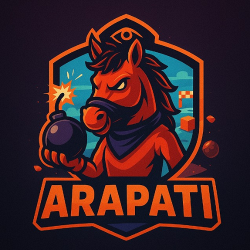
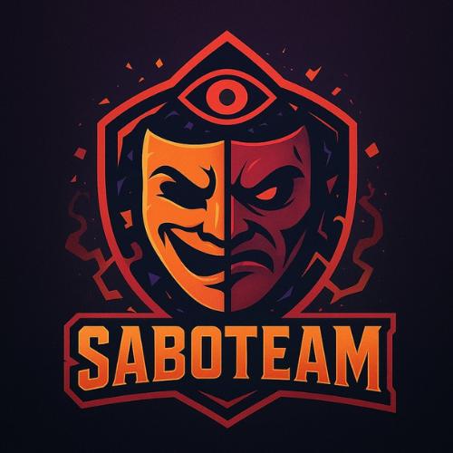
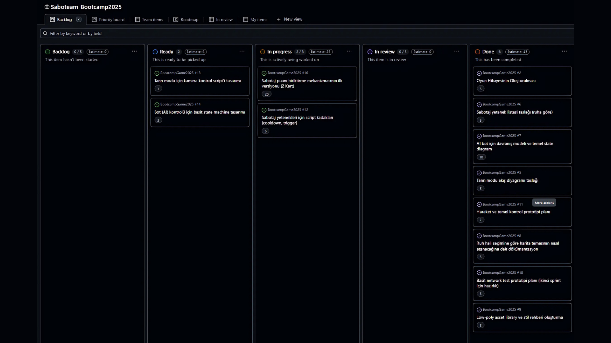

# Takım İsmi

ArapAtı

# Takım Logosu

# Takım Üyeleri

| Üye Adı            | Rol              | 
|--------------------|------------------|
| Esra Bingöl        | Developer        | 
| Fatih Emre Keloğlu | Product Owner    | 
| Cesim Uygun        | Developer        | 
| Yaren Doğan        | Scrum Master     | 
| Büşra Asan         | Developer        | 

# Takım İsmi 
SABOTEAM
# Oyun Logosu

# Oyun Açıklaması

SaboTeam, oyuncuların seçtikleri ruh halleriyle şekillenen dinamik haritalarda yarıştığı, gizem ve stratejiyi harmanlayan çok oyunculu bir 3D parti oyunudur.

Her oyun başında bir oyuncu gizli hain olarak seçilir ve seçtiği ruh haline uygun özel bir harita, tema ve görev seti belirlenir. Hain, sabotaj puanları toplayarak “tanrı moduna” geçebilir; bu modda haritaya tepeden bakar, diğer oyuncuları görebilir ve seçtiği ruh haline özgü sabotaj yeteneklerini kullanarak kaos yaratır. Sabotaj bitince yeniden normal oyuncu gibi devam eder, tanrı modundayken ise karakteri bir yapay zeka tarafından kontrol edilerek hainin kimliği gizli tutulur.

Oyuncuların amacı, hainin kurduğu tuzaklara ve engellere rağmen haritayı tamamlamak ve tur sonunda hainin kim olduğunu doğru tahmin etmektir. Her tur bitiminde hem oynanış başarısı hem de doğru tahminlerden puan kazanılır; birkaç turun ardından genel sıralama açıklanır.

SaboTeam, her seferinde değişen atmosferi, mood tabanlı harita ve sabotajları, gizli hain mekaniği ve dinamik oyun yapısıyla gerilimi, eğlenceyi ve stratejiyi bir arada sunar.
# Oyun Hikayesi
Bir zamanlar insanların bastırdığı duygularını ortaya çıkarmak için geliştirilen bir deney vardı.
Bu deney, insanların bilinçaltındaki ruh hâllerini dijital dünyaya yansıtan, yaşayan bir labirent yaratmayı amaçlıyordu.

Ancak labirent beklenenden çok daha fazlasına dönüştü. Seçilen her ruh hâli, sadece ortamı değil; orada oynayanların zihnini de şekillendirmeye başladı. Katılımcılar, kendi karanlıklarıyla yüzleşiyor, korkularını ve arzularını gerçek gibi deneyimliyordu.

Derken bir kırılma noktası oldu: Labirentin derin kodlarına, bir “hain” rolü eklendi. Artık her turda içlerinden biri, diğerlerinin ilerleyişini sabote etmekle görevlendiriliyordu. Bu hain, tanrı gibi haritayı görebiliyor; ruh hâlinin getirdiği güçle tuzaklar kurabiliyor; ama kimliği gizli kalıyordu.

Bu noktadan sonra SaboTeam, bir oyundan çok daha fazlasına dönüştü:
Bir güven testi, bir psikolojik deney ve en çok da insanın kendi içindeki karanlıkla yüzleşme serüveni hâline geldi.

Ve hâlâ her yeni oyunda aynı soru yankılanıyor:
Asıl düşman kim? Labirent mi, yoksa içimizdeki hain mi?

# Oyun Özellikleri
- 3D
- Çok oyunculu (minimum 4 oyuncu)
- Low-poly grafikler
- Ruh hâline göre değişen haritalar ve temalar
- Sabotaj ve tanrı modu mekaniği
- AI kontrollü hain karakter
- Parti / sosyal gizlilik mekaniği

# Hedef Kitle
- Sosyal ve çok oyunculu parti oyunlarını sevenler
- Değişken haritalarda keşif yapmayı seven oyuncular
- Strateji ve gizlilik unsurlarını eğlenceli bir şekilde deneyimlemek isteyenler
- Bağımsız (indie) oyun meraklıları
- Arkadaşlarıyla eğlenirken aynı zamanda “kim hain?” gerilimini yaşamak isteyen oyuncular

# Pazarlama Stratejisi

**Steam ve Dijital Platform Varlığı:** Oyunumuz için kapsamlı bir Steam sayfası hazırlanacak. Burada, oyunun oynanış videoları, ruh hali temaları ve sabotaj mekanikleri ön plana çıkarılacak. Ayrıca itch.io gibi indie platformlarda da görünürlük sağlanacak.

**Topluluk ve Influencer İşbirlikleri:** Discord sunucusu kurularak oyuncuların bir araya gelip stratejiler paylaşabileceği, hain kimliğini tartışabileceği aktif bir ortam oluşturulacak. Aynı zamanda, oyun içeriği üreten YouTuber ve Twitch yayıncılarıyla işbirlikleri yaparak, oyun deneyimini geniş kitlelere ulaştıracağız.

**Düzenli İçerik Güncellemeleri:** SaboTeam'e yeni ruh halleri, haritalar ve sabotaj yetenekleri ekleyerek oyuncuların ilgisini uzun vadede canlı tutacağız. Geri bildirimlerle şekillenen güncellemeler, oyuncu bağlılığını artıracak.

**Erişilebilir Fiyatlandırma:** Oyunu 5-7 dolar aralığında konumlandırarak, indie oyun severlerin kolayca erişebileceği bir fiyat stratejisi izleyeceğiz. Oyun demosu veya erken erişim seçenekleri ile oyunculara deneyimleme fırsatı da sunabiliriz.

**Marka Sadakati İçin Merchandise:** SaboTeam temasına uygun tişört, kupa ve poster gibi ürünler, topluluğumuzun aidiyet duygusunu güçlendirecek. Özel koleksiyonlar ve sınırlı sayıda çıkan ürünlerle heyecan yaratacağız.

**Sosyal Medya ve Etkinlikler:** Instagram, Twitter gibi platformlarda oyun atmosferini yansıtan görsel paylaşımlar, mini hikayeler ve oyuncu başarıları öne çıkarılacak. Ayrıca çevrimiçi turnuvalar ve yarışmalarla oyuncu etkileşimi artırılacak.

# Product Backlog URL
[Project Link](https://github.com/users/YarenBahce/projects/6/views/1)

---

- Projenin Toplam Puanı: 210
- Her Sprinte Ayrılan Puan: 70
- Sprint 1 Tamamlama Oranı: 63/70

---
# 🚀 Sprint 1

## 📝 Sprint Notları
Bu sprint, Saboteam projesinin temelini oluşturacak araştırma ve teknik hazırlık süreci olarak planlandı.  
Ana odak noktaları:
- Oyun fikrinin netleştirilmesi
- Ruh halleri, sabotaj mekanikleri ve harita temalarının belirlenmesi
- Teknoloji altyapısı ve görsel stil araştırması

Toplam 70 puanlık backlog’un ilk kısmı; araştırma ve tasarım odaklı görevler bu sprinte dağıtıldı.

## 🗂 Backlog Düzeni ve Story Seçimleri
Sprint 1’de ağırlıklı olarak:
- Oyun tasarımı ve temel dokümantasyon
- Ruh hali bazlı harita & tema taslakları
- Sabotaj sistemi ve tanrı modu akış diyagramı
- AI bot davranış modeli tasarımı
- Low-poly görsel stil ve moodboard hazırlanması
- Ses ve atmosfer örnekleri araştırması

## 📅 Daily Scrum / Toplantılar
- Daily toplantılar Whatsapp üzerinden yapıldı.
[📄 Sprint 1 Daily Notes](https://drive.google.com/drive/folders/1JUPX_urSHvUJ3oebjfuKyc9MK6hxLvOm?usp=sharing)

## 📌 Sprint Board Görünümü

## ✅ Sprint Review
- İlk sprintte oyun fikri ve tasarım detayları netleştirildi.
- Hain tanrı modu, ruh hali seçimine göre değişen haritalar ve AI bot kontrolü gibi mekanikler üzerine karar alındı.
- Low-poly, renkli ve esprili bir görsel stil benimsendi.

## 🔄 Sprint Retrospective
- Daha fazla prototip ve doküman hazırlamanın önemli olduğu görüldü.
- Haftada 3 düzenli toplantı yapılmasına karar verildi.
- Gelecek sprintte hedefler:
  - Basit bir oynanabilir prototip (hareket, sabotaj testi)
  - Temel UI taslakları
  - Sabotaj yeteneklerinden en az birinin prototipi

## ✏️ Özet
Sprint 1, Saboteam’in temellerini atmak için **araştırma**, **dokümantasyon** ve **tasarım hazırlıkları**yla geçti.  
Bir sonraki sprintte ilk prototip hedefleniyor. 🎮

---
# 🚀 Sprint 2

## 📝 Sprint Notları
Bu sprint, Saboteam projesinin temel mekaniklerinin uygulanması ve prototip aşamasına geçişi kapsıyor.  
Ana odak noktaları:
- Multiplayer oyuncu altyapısı oluşturulması
- UI ekranları'nın oluşturulması
- Tur sisteminin oluşturulması
- En az 1 haritanın oluşturulması
- Haritaların belirlenmesi

## 🗂 Backlog Düzeni ve Story Seçimleri
Sprint 2’de öne çıkan görevler:
  - Multiplayer oyun altyapısı (4 oyunculu)
  - Oyun UI ekranlarının belirlenmesi
  - Asset kütüphanesi genişletme (karakter ve harita için) 
  - Harita tema uygulaması (1 ruh hali)  
  - AI bot üzerine çalışmalar
  - Tur yönetim sistemi (4 tur oyun döngüsü)  

## 📅 Daily Scrum / Toplantılar
- Daily toplantılar Whatssapp ve Google Meets üzerinden yapıldı.  
[📄 Sprint 2 Ekran Ve Toplantı Görüntüleri](https://drive.google.com/drive/folders/1JUPX_urSHvUJ3oebjfuKyc9MK6hxLvOm?usp=sharing)  

## 📌 Sprint Board Görünümü  
  

## ✅ Sprint Review  
- 4 kişilik Multiplayer altyapı başarı ile tamamlandı. 
- Oyun UI ekranları oluşturuldu.
- AI bot davranışları için temel paternler araştırıldı.
- Asset kütüphanesi genişletildi.  

## 🔄 Sprint Retrospective  
- **İyi Yönler**:  
  - Prototiplerin hızlı teslimi ve fizik mekaniklerinin sorunsuz çalışması.  
  - Network testlerinin erken aşamada yapılması.  
- **Geliştirilecek Alanlar**:  
  - Kod review süreçlerinin daha sıkı takip edilmesi.  tahmini aşıldı).  

## ✏️ Özet  
Sprint 2, **prototipleme** ve **temel mekaniklerin uygulanması** ile geçti. Bir sonraki sprintte:  
- Karakter mekanikleri üzerine çalışılması
- UI tasarımlarının entegrasyonu tamamlanması
- AI botlar eklenmesi
- Haritalar tamamlanması
hedefleniyor. 
